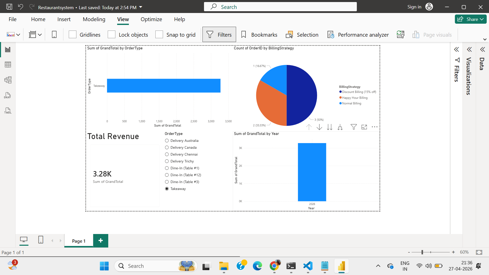
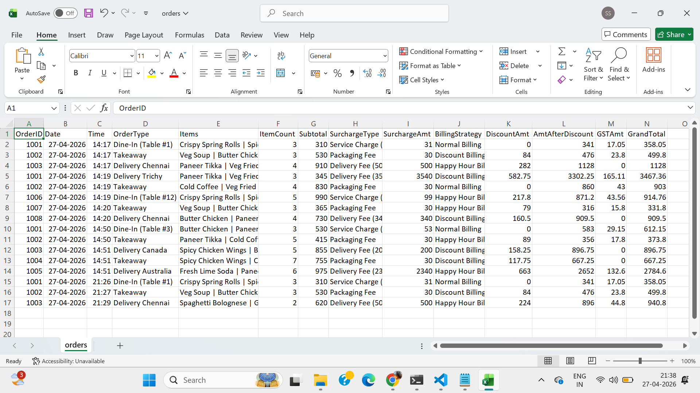

# Restaurant Order & Menu Simulation System

## Overview

A Java-based OOP project that simulates a real-world restaurant system with multiple order types and billing strategies.

## Features

* Dine-In, Takeaway, Delivery orders
* Polymorphic billing system (Strategy pattern)
* Encapsulation, Inheritance, Abstraction
* CSV data generation for Power BI analysis

## Tech Stack

* Java (OOP)
* File Handling (TXT, CSV)
* Power BI (Analytics)

## Project Structure

* model/ → Menu items (Appetizer, MainCourse, Beverage)
* order/ → Order types (DineIn, Delivery, Takeaway)
* billing/ → Billing strategies (Normal, Discount, HappyHour)
* util/ → File handling & menu manager
* main/ → Entry point (RestaurantApp)

## How to Run

1. Compile:
   javac -d . model/*.java order/*.java billing/*.java util/*.java main/*.java

2. Run:
   java main.RestaurantApp

## Output

* orders.txt → formatted bill records
* orders.csv → structured data for Power BI

## Screenshots

### Power BI Dashboard

### CSV Data Output

### Console Output

## Power BI Dashboard

The CSV file generated by the system is used for data visualization in Power BI.

### Key Visuals:
- Total Revenue (Card)
- Total Orders (Card)
- Revenue by Category (Bar Chart)
- Order Type Distribution (Pie Chart)
- Sales Trend Over Time (Line Chart)

### Features:
- Interactive filtering using slicers (Order Type, Category)
- Real-time data updates using Refresh
- Business insights from simulated restaurant data

### Insights:
- Main Course items generate the highest revenue
- Dine-In orders are more frequent than Delivery
- Peak sales occur during specific time periods

## Author
Santhakumari S
